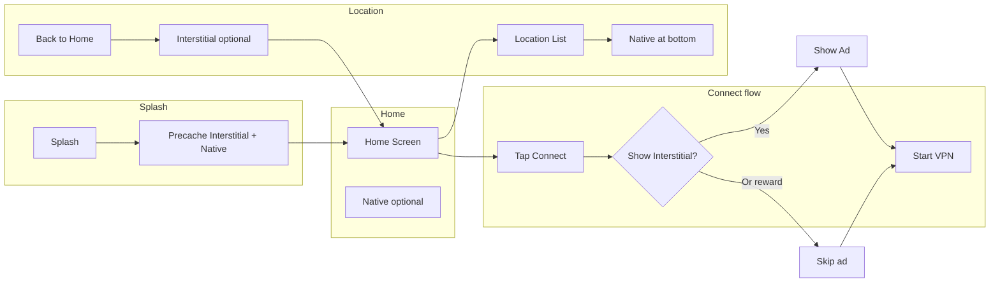

# Ads Strategy and Implementation Plan for PureNET VPN

## Current state

- **Ad code exists but is disabled**: [lib/helpers/ad_helper.dart](lib/helpers/ad_helper.dart) has Interstitial, Native, and Rewarded logic (all commented). [lib/helpers/config.dart](lib/helpers/config.dart) already has Remote Config keys: `interstitial_ad`, `native_ad`, `rewarded_ad`, `show_ads`.
- **Placement hooks are commented**: Interstitial before VPN connect in [lib/controllers/home_controller.dart](lib/controllers/home_controller.dart) (line 36–38); native at bottom of [lib/screens/location_screen.dart](lib/screens/location_screen.dart); precache in [lib/screens/splash_screen.dart](lib/screens/splash_screen.dart); `AdHelper.initAds()` in [lib/main.dart](lib/main.dart).
- **Reward UI exists but is unused**: [lib/widgets/watch_ad_dialog.dart](lib/widgets/watch_ad_dialog.dart) is built for “Watch Ad to Change Theme” but is never shown (no theme toggle in the app currently).
- **App flow**: Splash → Home (connect/disconnect, stats, “Change Location”) → Location (server list) → Network Test (IP info). Selecting a server in Location can trigger connect on return.

---

## Which ads are best for this app

| Ad type          | Fit for your app  | Reason                                                                                                                   |
| ---------------- | ----------------- | ------------------------------------------------------------------------------------------------------------------------ |
| **Interstitial** | **Yes – primary** | High eCPM; natural breaks: before/after VPN connect, when leaving Location. User expects a short pause at these moments. |
| **Rewarded**     | **Yes – primary** | Highest eCPM; user opts in. Ideal for “skip this ad”, “change theme”, or “ad-free for X minutes”.                        |
| **Native**       | **Yes**           | Good eCPM, blends in. Already planned: bottom of Location list; can add one small unit on Home (e.g. below stats).       |
| **Banner**       | Optional          | Lower eCPM; can add on Home or Location if you want constant presence without blocking.                                  |

**Recommendation:** Use **Interstitial + Rewarded + Native**. Add Banner only if you want extra fill after the above are in place.

---

## Recommended placement (where to show ads)

- **Splash (after 1.5s delay):** Only precache; do **not** show an ad here (bad UX for a VPN app that should feel fast).
- **Home:** One small **native** unit below the download/upload cards (optional). Keeps screen clean.
- **VPN connect (main revenue):** When user taps “Tap to Connect”:
  - **Option A (simplest):** Show **interstitial** once, then start VPN in `onComplete`.
  - **Option B (max revenue + reward):** Show a small dialog: “Watch a short ad to connect without an ad” or “Connect now (ad after)” then either show **rewarded** (if they choose “Watch ad”) and then connect with no interstitial, or connect and show **interstitial** after. Reward flow = watch ad → grant “skip next interstitial” or “connect without interstitial this time”.
- **Location screen:** **Native** banner at bottom (your existing commented code). Optional: **interstitial** when user taps **Back** to home (frequency cap: e.g. once per 2–3 minutes or once per session).
- **Network Test:** Optional interstitial when leaving (lower priority).

---

## Reward ads: flow and implementation

### Reward flow options

1. **Watch ad → skip next interstitial (recommended)**
  User taps Connect → dialog: “Watch an ad to connect without an ad” / “Connect with ad”. If they watch rewarded ad, connect without showing interstitial. If they choose “Connect with ad”, show interstitial then connect.  
  - **Revenue:** Rewarded eCPM is higher than interstitial; you still show one of the two each time.
2. **Watch ad → change theme**
  Add a theme toggle (e.g. in app bar or settings). On tap → show [WatchAdDialog](lib/widgets/watch_ad_dialog.dart) → “Watch Ad to Change Theme” → `AdHelper.showRewardedAd(onComplete: () { Pref.isDarkMode = !Pref.isDarkMode; ... })`.  
  - **Revenue:** Extra rewarded views from users who want to switch theme.
3. **Watch ad → ad-free for 30 minutes**
  Store a timestamp in Pref when user completes a rewarded ad. For the next 30 minutes, do not show interstitials (e.g. in `connectToVpn` and on back from Location).  
  - **Revenue:** Fewer interstitials but more rewarded; good balance if you cap “ad-free” duration.

**Recommended combo:** Implement **(1) + (2)**. Add (3) later if you want.

### Reward implementation details (fixes in `ad_helper.dart`)

Your current rewarded snippet in [lib/helpers/ad_helper.dart](lib/helpers/ad_helper.dart) (lines 160–189) has two issues:

- **Callback only on reward:** `onComplete()` is called in `onUserEarnedReward`. You must **not** call `onComplete()` when the user closes the ad without earning (so they don’t get the benefit for free). The current code is correct for that, but you should always dismiss the loading dialog when the ad is dismissed (whether or not they earned the reward).
- **Loading and dismiss:** Use `fullScreenContentCallback` (e.g. `onAdDismissedFullScreenContent`) to run `Get.back()` (dismiss progress) and optionally run a “cancel” path. Call `onComplete()` only inside `onUserEarnedReward`.

Suggested pattern:

- `showRewardedAd(onComplete: VoidCallback onComplete, {VoidCallback? onSkipped})`
- In `onUserEarnedReward`: call `onComplete()` (grant reward).
- In `fullScreenContentCallback.onAdDismissedFullScreenContent`: `Get.back()` (dismiss progress), then call `onSkipped?.call()` if you need to track “closed without reward”.
- In `onAdFailedToLoad`: `Get.back()` and optionally `onSkipped?.call()` so UI can revert.

Preload rewarded when possible (e.g. after showing one, load the next in background) to avoid delay when user taps “Watch Ad”.

---

## Max revenue approach (summary)

- **Precache:** Interstitial + Native at splash; optionally preload one Rewarded after first use.
- **Interstitial:** Once per VPN connect (or after connect); optionally once when leaving Location (frequency cap).
- **Rewarded:** “Watch ad to skip connect ad” on Connect; “Watch ad to change theme” on theme toggle. Only call reward `onComplete` when `onUserEarnedReward` fires.
- **Native:** Location screen bottom; optionally Home below stats.
- **Frequency cap:** e.g. max one interstitial per 2–3 minutes or per connect; don’t show interstitial on every Back from Location.
- **Remote Config:** Keep using `show_ads` so you can turn off or test without a new release.

---

## Implementation checklist (no code changes in this plan)

1. **Re-enable and fix ads**
  - Uncomment and wire [lib/helpers/ad_helper.dart](lib/helpers/ad_helper.dart) (init, precache, show Interstitial/Native/Rewarded).
  - Fix rewarded: add `fullScreenContentCallback` to dismiss progress and optionally `onSkipped`; call `onComplete` only in `onUserEarnedReward`.
  - Uncomment [lib/controllers/native_ad_controller.dart](lib/controllers/native_ad_controller.dart) and ensure `loadNativeAd` is used with a controller instance.
2. **App lifecycle**
  - [lib/main.dart](lib/main.dart): call `await AdHelper.initAds()` after Config and Pref init.
  - [lib/screens/splash_screen.dart](lib/splash_screen.dart): after delay, call `AdHelper.precacheInterstitialAd()` and `AdHelper.precacheNativeAd()` then navigate to Home.
3. **Interstitial placement**
  - [lib/controllers/home_controller.dart](lib/controllers/home_controller.dart): in `connectToVpn()`, when starting VPN, wrap `VpnEngine.startVpn(vpnConfig)` in `AdHelper.showInterstitialAd(onComplete: () async { await VpnEngine.startVpn(vpnConfig); })`. If you add “watch ad to skip”, show a dialog first; on “Watch ad” call `showRewardedAd` and in `onComplete` start VPN without interstitial; on “Connect with ad” use the existing interstitial then start VPN.
4. **Native placement**
  - [lib/screens/location_screen.dart](lib/screens/location_screen.dart): uncomment `NativeAdController` and bottom banner `AdWidget`.
  - Optionally add one small native on [lib/screens/home_screen.dart](lib/screens/home_screen.dart) below the stats row.
5. **Reward flows**
  - **Connect flow:** Before starting VPN, show dialog with “Watch ad to connect without ad” / “Connect with ad”. Wire “Watch ad” to `AdHelper.showRewardedAd(onComplete: () => startVpnWithoutInterstitial())`.
  - **Theme flow:** Add a theme toggle (e.g. icon or settings). On tap, show `WatchAdDialog`; on “Watch Ad”, call `AdHelper.showRewardedAd(onComplete: () { Pref.isDarkMode = !Pref.isDarkMode; Get.forceAppUpdate(); })`.
6. **Optional**
  - Interstitial when leaving Location (with frequency cap).
  - Preload next Rewarded after a successful rewarded show.
  - Store “ad-free until” timestamp in Pref and skip interstitials until that time when implementing “ad-free for 30 min”.

This gives you a clear map of which ads to use, where, how reward ads should behave, and how to implement them for maximum revenue without hurting UX.